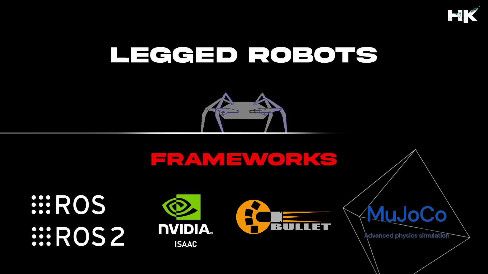

<!-- README: HariKrishna_ComputerVision-->

© Documentation by tvharikrishna

1 minute read 📚

    

# 🔻 What are Legged Robots?

Legged robots are advanced robotic systems designed to navigate various terrains using legs, similar to animals. This category includes bipedal robots (two legs), quadruped robots (four legs), and more complex forms like spider robots with eight legs. These robots are designed to handle tasks in challenging environments.

# 🔻 Repository Details

This repository contains various simulations of legged robots, including bipedal, quadruped, and spider-like robots, focusing on their locomotion strategies, SLAM, navigation, motion planning and physics analysis. The simulations are conducted using PyBullet, MuJoCo, NVIDIA Isaac Sim, and Gazebo, leveraging both ROS 1 and ROS 2 frameworks.

<!-- Repo Details -->
<h1 align="left">🔻 Repository Details</h1>
<table align="center">
<thead>
<tr>
<th align="center">Naming Prefix</th>
<th align="center">Description</th>
</tr>
</thead>
<tbody>
<tr>
<td align="center"><strong>HKISAAC</strong></td>
<td align="center">Simulations in NVIDIA Isaac</td>
</tr>
<tr>
<td align="center"><strong>HKMUJOCO</strong></td>
<td align="center">Simulations in MuJoCo</td>
</tr>
<tr>
<td align="center"><strong>HKBULLET</strong></td>
<td align="center">Simulations in PyBullet</td>
</tr>
<tr>
<td align="center"><strong>HKROS</strong></td>
<td align="center">Simulations in Gazebo</td>
</tr>
</tbody>
</table>

     

    

